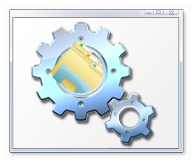

!!! NOTICE !!!
I am shutting down this repo as it is filled with useless features and is overcomplicated. To prove how bloated it is, I recreated the entire tool in BATCH. Copy this code into a batch file and it will basically be identical to this disgusting project:
```batch
echo OjogVGhpcyBjb2RlIGlzIGFic29sdXRlIGdhcmJhZ2UgYnV0IGl0IHdvcmtzDQpzZXQgbmFtZT0lfm4xLmJhdA0KOmxvb3ANCmNlcnR1dGlsIC1lbmNvZGVoZXggLWYgJTEgdGVtcDIgMHg0MDAwMDAwMQ0KZWNob3xzZXQgL3A9ImVjaG8gIiA+PiB0ZW1wDQpjb3B5IHRlbXArdGVtcDIgL2INCmRlbCB0ZW1wMg0KZWNobyAgXj4gdGVtcCA+PiB0ZW1wIA0KZWNobyBjZXJ0dXRpbCAtZGVjb2RlIHRlbXAgJX5uMSV+eDEgPj4gdGVtcA0KZWNobyBkZWwgdGVtcCAvcSA+PiB0ZW1wDQpzaGlmdA0KaWYgbm90ICIlfjEiPT0iIiBnb3RvIGxvb3ANCnJlbmFtZSB0ZW1wICVuYW1lJQ== > temp  
certutil -decode temp bARC.bat 
del temp /q 
del bARCI.bat /q
```

If you are interested in this bloated project however, it will be archived. You can still clone the repo and build it, you just cant commit to it. Now for the actual readme

# bARC

---
A data archiving utility

## How do I use it?
You can get binaries [here](https://github.com/Finxx1/DAT2BAT/releases) and just drag files on to ```bARC.exe```. However, if the exe does not work, use the below steps.
### Prerequisites
Install python [here](https://www.python.org/downloads/), making sure to select Add Python (Version) to PATH.
### Method 1.
1. Clone this repo
2. Right-click the bARC.py file and click properties
3. Press the button that says ```CHANGE```
4. Select ```Python```
5. Press ```OK```
6. Select the files you want to archive.
7. Drag them on to bARC.py
### Method 2.
1. Open Command Prompt
2. Navigate to the folder containing bARC.py
3. Type ```py bARC.py <file(s)>```
---
If you followed the steps correctly, you will end up with a batch script that can work even without bARC, making it perfect for sharing multiple files with other people in an easy and efficient way.

## Passwords

To make an archive require a password, you have to use the command line. Typing ```py bARC.py -pass <password> <file(s)>``` will give you an archive that requires a password to open.

## How does it work?
The Python script takes in any number of files and outputs a batch script. The batch script works by echo-ing the Base64 data of the files archived by bARC into a file called ```temp```. Then, we call ```certutil -decode```. This program comes bundled with windows 7, 8, 8.1, and 10. It decodes the data and outputs it as a file with the same name as the archived file. For more info, check out [this](Doc/DEV.md)
